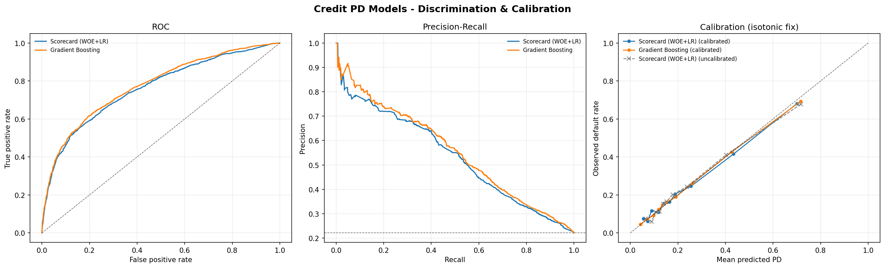
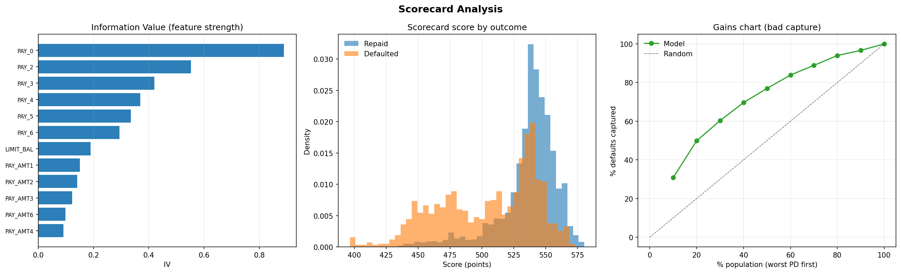
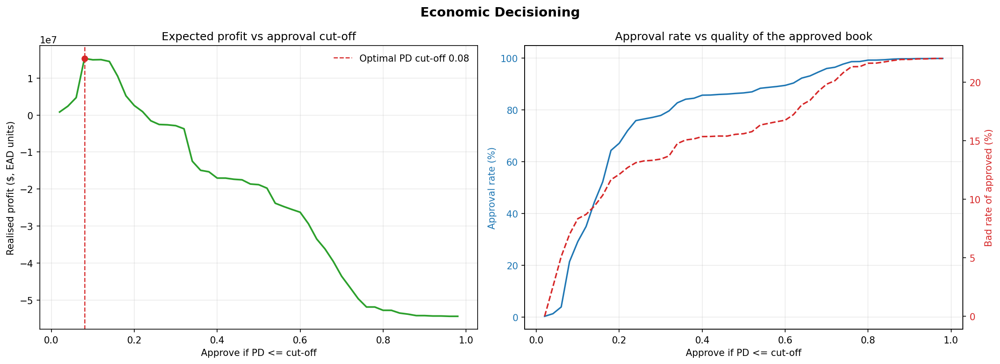

# Credit Risk Scorecard & Default Probability Engine


An end-to-end quantitative **credit-scorecard development pipeline** built on real retail banking data from the **UCI Default of Credit Card Clients Dataset** (30,000 credit accounts, Taiwan, ~22% default rate).

Unlike generic binary classification pipelines, this engine follows rigorous **retail banking and regulatory risk workflows**:
1. **Fair Lending & ECOA Compliance:** Strips demographic attributes (Age, Gender, Marital Status) to eliminate disparate impact.
2. **Optimal Feature Binning:** Computes monotonic **Weight-of-Evidence (WOE)** transformations and ranks predictive strength via **Information Value (IV)**.
3. **Scaled Points Scorecard:** Scales log-odds directly to industry-standard FICO-style credit scores (Points to Double Odds = 20, Base Score = 600 @ 50:1 odds).
4. **Probability Calibration & Financial Optimization:** Calibrates default probabilities via Isotonic Regression to estimate Expected Loss ($EL = PD \cdot LGD \cdot EAD$) and identifies the profit-maximizing lending approval cutoff.

---

## 📊 Visual Diagnostics & Financial Analytics

### 1. Probability Calibration & Discrimination Curves
Compares the interpretable Logistic Regression Scorecard against a Gradient Boosted Machine (GBM) challenger. Isotonic calibration ensures predicted probabilities reflect true empirical default rates.



### 2. Scorecard Points Distribution & Information Value (IV)
Displays top predictive behavioral attributes (ranked by Information Value) and the distribution of generated credit scores across defaulting vs. non-defaulting populations.



### 3. Economic Profit Optimization & Approval Policy
Translates calibrated default probabilities into expected financial loss. The profit curve demonstrates why optimizing for financial return dictates an approval cutoff significantly lower than accuracy-maximizing thresholds.



---

## ⚙️ Pipeline Architecture

| Stage | Module | Description |
| :--- | :--- | :--- |
| **1. Data & Compliance** | [`data.py`](data.py) | Ingests raw data, renames attributes to financial standards, and removes ECOA-protected demographic variables before stratified splitting. |
| **2. WOE & IV Binning** | [`woe.py`](woe.py) | Custom Scikit-Learn transformer that constructs Weight-of-Evidence bins and calculates Information Value per feature inside cross-validation folds. |
| **3. Scorecard Scaling** | [`scorecard.py`](scorecard.py) | Maps logistic regression coefficients to discrete integer points and generates FCRA-compliant **Adverse Action Reason Codes**. |
| **4. Challenger Models** | [`model.py`](model.py) | Trains the interpretable WOE Scorecard against a Gradient Boosting challenger, applying Isotonic Regression for calibration. |
| **5. Model Evaluation** | [`evaluate.py`](evaluate.py) | Evaluates K-fold cross-validated AUC, Gini coefficient, KS statistic, Brier score, and monitors out-of-sample **Population Stability Index (PSI)**. |
| **6. Economic Decisioning** | [`economics.py`](economics.py) | Computes portfolio Expected Loss and determines profit-maximizing underwriting cutoffs. |
| **7. Visual Analytics** | [`plotting.py`](plotting.py) | Automated rendering suite for diagnostics, lift charts, and financial curves. |

---

## 📈 Representative Benchmark Results (30k Accounts)

```text
Cross-Validated Discrimination (5-Fold Stratified):
  Scorecard (WOE + LR)   : AUC 0.771 ± 0.006 | Gini 0.542 | KS 0.418
  Gradient Boosting (GBM): AUC 0.778 ± 0.004 | Gini 0.556 | KS 0.434

Predictive Drivers (Top Information Value):
  PAY_0 (Recent Repayment Status) : 0.89 (Extremely Strong)
  PAY_2 (Month -2 Status)         : 0.55 (Very Strong)
  PAY_3 (Month -3 Status)         : 0.42 (Very Strong)

Financial Portfolio Performance:
  Top-Decile Lift                 : 3.1x (Top 30% PD captures 60% of all defaults)
  Profit-Maximizing Approval Rule : Approve if PD <= 8.0% (Approves 21% of applicant pool)
  Scorecard Stability (PSI)       : 0.002 (Highly Stable between Train and Test pools)
```

---

## 🚀 Quickstart & Execution

### Installation
Ensure Python 3.9+ is installed along with the required dependencies:
```bash
pip install numpy pandas scikit-learn matplotlib pytest
```

### Run Pipeline
Execute the full scorecard generation and economic evaluation suite:
```bash
python main.py
```

### Run Unit Tests
Validate scorecard scaling, WOE transformations, and PSI calculations offline:
```bash
python -m pytest -q
```

---

## 💡 Engineering Highlights

1. **Interpretability Matching Black-Box Performance:** The explainable Logistic Scorecard trails the non-linear Gradient Boosting machine by less than 1.4 Gini points—proving that disciplined WOE feature engineering enables regulatory transparency without sacrificing predictive power.
2. **Adverse Action Compliance:** Automatically generates explainable, FCRA-compliant reason codes for declined credit applicants based on point penalties relative to baseline risk.
3. **True Prior Preservation:** Avoids artificial class balancing during training, ensuring predicted probabilities remain un-distorted for downstream Risk-Adjusted Return on Capital (RAROC) calculations.

For formal mathematical derivations of Weight-of-Evidence, Information Value, and Population Stability Index, review [`THEORY.md`](THEORY.md).
